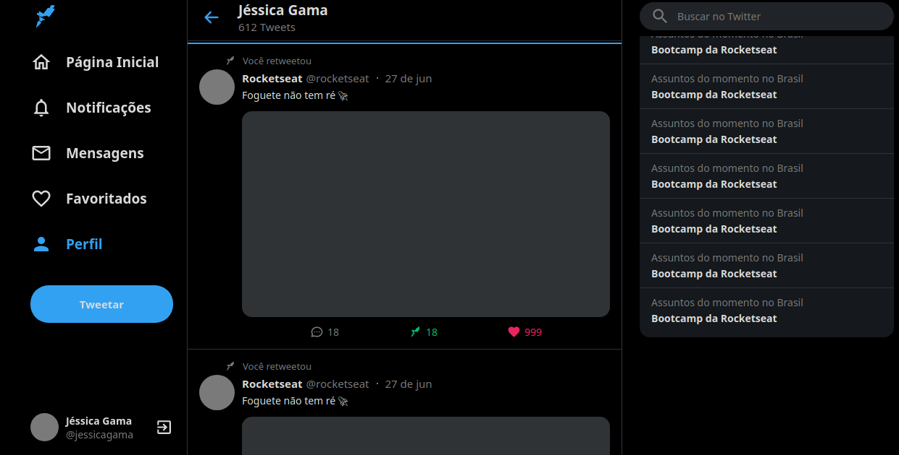

# Aplicação:

<a href="https://jessica-twitter.netlify.app/" target="_blank" >Clique aqui para abrir a aplicação do Twitter</a>

# Criando projeto

 -- Comando para criar o projeto:

 - `npx create-react-app nomedoprojeto --template=typescript`

 -- Se não inserir o `--template=typescript` o projeto será criado com java ao inves de typescript

 ou se estiver instalado o yarn: 

 - `yarn create-react-app nomedoprojeto --template=typescript`

-- Para rodar a aplicação:

 - `yarn start`

-  ou pode entrar no package.json e ver os scripts, o comando que estiver lá deverá ser usado para executar a aplicação

### Extensões:

- colorize: mostra as cores declaradas
- vscode-styled-components: permite que o css seja estilizado dentro do type
- rocketseat react js e rocketseat react native: atalhos para a criação de components (snippets)
- bracket pair colorizer - {} são personalizados
- prettier: identação do código

### Configurando ambiente:

criar arquivos .prettierrc e .editorconfig na raiz do projeto:

- .prettierrc e .editorconfig são arquivos de configuração

na pasta src deixar apenas os arquivos:

- App.tsx, index.tsx e react-app-env.d.ts

### Instalando dependecias:

`yarn add styled-components styled-icons`

- styled-components: auxilia na estilização do css

- styled-icons: uma biblioteca de icones

`yarn add react-sticky-box`

- sticky-box: auxilia na responsividade

-- dependencias de desenvolvimento:

`yarn add -D @types/styled-components`

- instalando para conseguir usar com o typescript

 

 no arquivo tsconfig.json: 

 - `"isolatedModules": false,`

 -- tsconfig.json:  especifica os arquivos raiz e as opções do compilador.

 

 ### Configurando aplicação:

 Criar pasta styles para inserir o GlobalStyles.ts

 Dentro da pasta src: 

 - criar pasta components

 - criar os componentes (Layout/Main...) e dentro dos respectivos uma index.tsx e um styles.ts

 

 ### Components:

 -- Os components devem ser declarados com a letra maiuscula: `<Container/>`

 -- root: insere em todo o site

 -- Importante se lembrar de sempre importar os componentes e bibliotecas que estão sendo utilizadas

 

